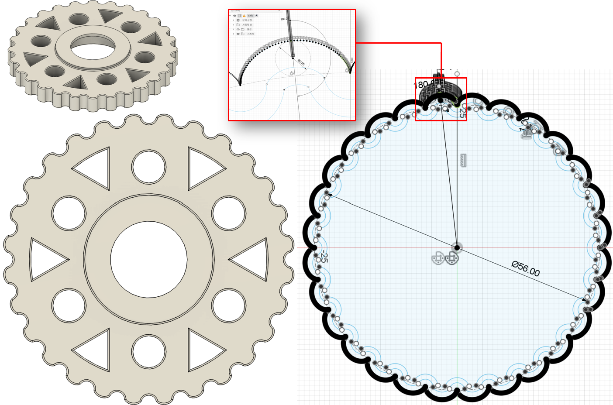
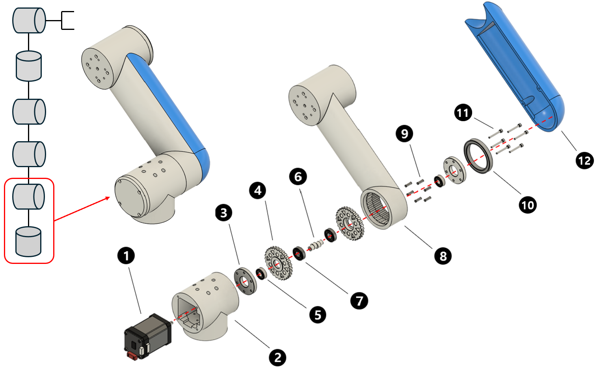
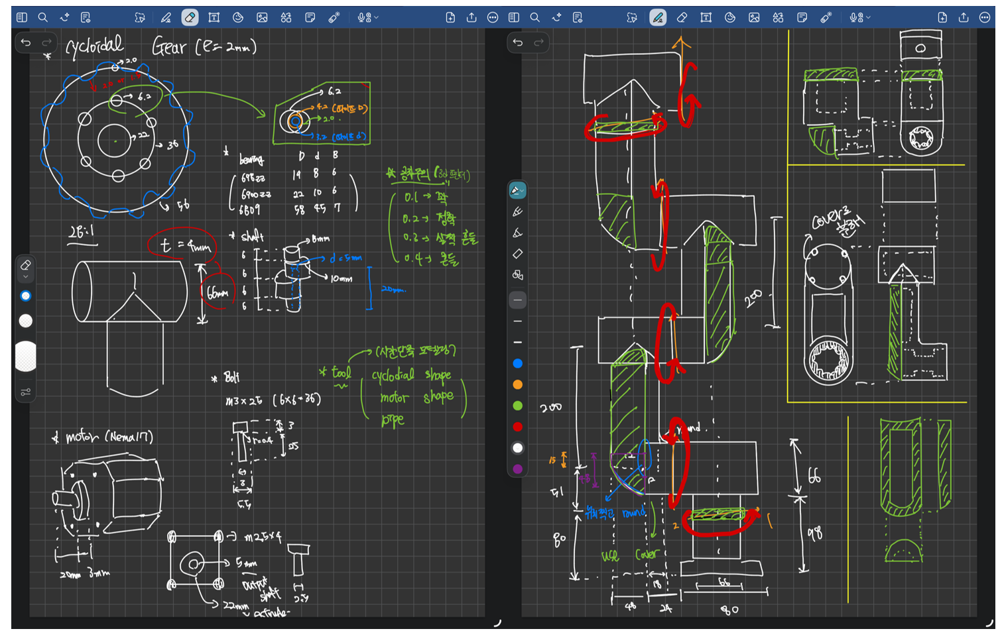

# 6Dof-Robot-Arm-Joint-Design-with-Cycloidal-Gear
A 3D-printable 6-axis robot arm design for avatar robot applications

## Overview

This project is an ongoing mechanical design project for a 6-axis robotic arm intended for future use in an avatar robot system.  
The arm is being designed in Fusion 360 with 3D printing in mind and uses a cycloidal gear reducer to reduce backlash in the joint mechanism.

  

  <b>Concept motion of the robotic arm</b>

---

## Design Goal

The goal of this project is to design a 3D-printable 6-axis robotic arm for avatar robot motion control.

A cycloidal gear reducer is applied to the joint structure to reduce backlash and improve motion transmission accuracy.  
The final goal is to integrate the robotic arm with a camera-based motion control system for avatar robot operation.

---

## Cycloidal Gear Reducer

The cycloidal gear reducer is used as the main reduction mechanism inside the robot arm joint module.

  

  <b>Cycloidal gear reducer design in Fusion 360</b>

The cycloidal gear profile was designed in Fusion 360 by plotting the path generated by a point on a rolling circle along the base circle according to a 28:1 reduction ratio.  
The plotted points were connected with a spline curve to create the basic cycloidal profile.

After generating the base profile, a 2 mm offset was applied to define the final tooth shape by considering the contact radius of the housing pins.

### Main Design Values

- Reduction ratio: 28:1
- Base circle diameter: 56 mm
- Rolling circle diameter: 2 mm
- Eccentricity: 2 mm
- Tooth profile generation: point-based spline curve
- Tooth offset: 2 mm

---

## Joint Assembly

The cycloidal gear reducer is integrated into the robot arm joint assembly with the motor, bearing, shaft, housing, and link structure.

  

  <b>Reducer-integrated joint assembly</b>

This assembly was designed to check the basic arrangement of the joint components and the assembly direction of the reducer-integrated structure.

---

## Current Status and Future Work

Currently, the cycloidal gear reducer and partial joint assembly have been designed.

Future work includes:

- Designing the remaining robot arm housing
- Completing the link and joint structure
- Checking component interference
- Refining the 3D-printable structure
- Integrating the arm with a camera-based avatar motion control system

---

## Appendix: Initial Hand Sketches

Initial hand sketches were used to plan the joint layout, gear placement, housing shape, and assembly direction.

  

  <b>Initial design sketches</b>

